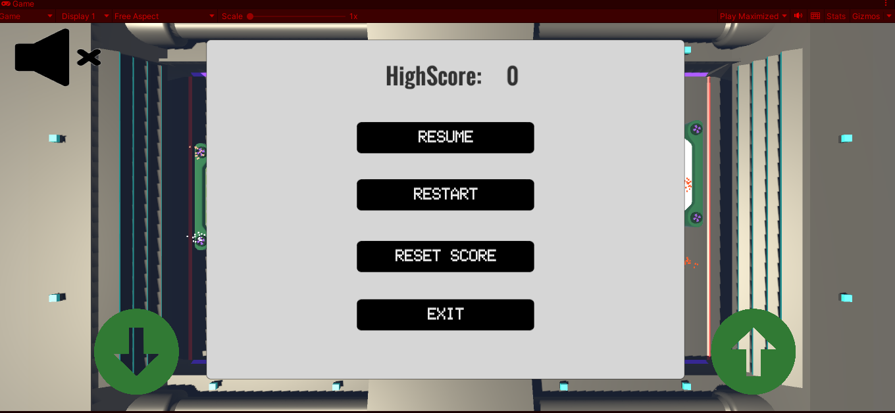

# 3D Pong: A Twist on a Classic (Unity)

Dive into the immersive world of 3D Pong, where classic arcade nostalgia meets modern gaming excitement! Developed as part of a dynamic university lab course project, this rendition of the beloved Pong game brings a fresh twist with stunning 3D graphics and engaging gameplay.

## Features
* Immersive 3D Environment
* Mobile-Friendly Precision
* Ball Particle Effect
* Ball Speed incrementing per collision

## Screenshots

